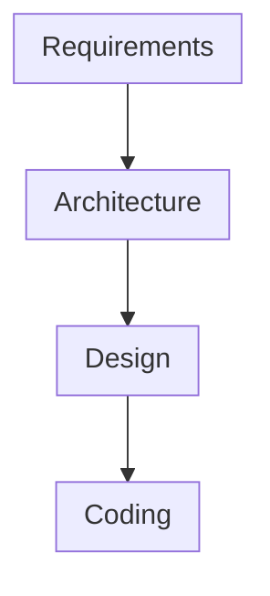

# Code Complete

> These are my personal study notes for `Code Complete`

## Table of Contents

| Part | Chapter | Section | Title                                                                  |  Page   |    Date    |
| :--: | :-----: | :-----: | :--------------------------------------------------------------------- | :-----: | :--------: |
|  I   |         |         | Laying the Foundation                                                  |         |            |
|      | [1](#1) |         | Welcome to Software Construction                                       |         | 07.23.2023 |
|      |         |   1.1   | What Is Software Construction?                                         | 003-005 |            |
|      |         |   1.2   | Why Is Software Construction Important?                                | 006-007 |            |
|      |         |   1.3   | How to Read This Book                                                  |   008   |            |
|      | [2](#2) |         | Metaphors for a Richer Understanding of Software Development           |         | 07.23.2023 |
|      |         |   2.1   | The Importance of Metaphors                                            | 009-010 |            |
|      |         |   2.2   | How to Use Software Metaphors                                          | 011-012 |            |
|      |         |   2.3   | Common Software Metaphors                                              | 013-022 |            |
|      | [3](#3) |         | Measure Twice, Cut Once: Upstream Prerequisites                        |         | 09.09.2023 |
|      |         |   3.1   | Importance of Prerequisites                                            | 023-030 |            |
|      |         |   3.2   | Determine the Kind of Software You're Working On                       | 031-035 |            |
|      |         |   3.3   | Problem-Definition Prerequisite                                         | 036-037 |            |
|      |         |   3.4   | Requirements Prerequisite                                              | 038-042 |            |
|      |         |   3.5   | Architecture Prerequisite                                              | 043-054 | 09.10.2023 |
|      |         |   3.6   | Amount of Time to Spend on Upstream Prerequisites                      | 055-060 |            |
|      |    4    |         | Key Construction Decisions                                             |         |            |
|      |         |   4.1   | Choice of Programming Language                                         |         |            |
|      |         |   4.2   | Programming Conventions                                                |         |            |
|      |         |   4.3   | Your Location on the Technology Wave                                   |         |            |
|      |         |   4.4   | Selection of Major Construction Practices                              |         |            |
|  II  |         |         | Creating High-Quality Code                                             |         |            |
|      |    5    |         | Design in Construction                                                 |         |            |
|      |         |   5.1   | Design Challenges                                                      |         |            |
|      |         |   5.2   | Key Design Concepts                                                    |         |            |
|      |         |   5.3   | Design Building Blocks: Heuristics                                     |         |            |
|      |         |   5.4   | Design Practices                                                       |         |            |
|      |         |   5.5   | Comments on Popular Methodologies                                      |         |            |
|      |    6    |         | Working Classes                                                        |         |            |
|      |         |   6.1   | Class Foundations: Abstract Data Types (ADTs)                          |         |            |
|      |         |   6.2   | Good Class Interfaces                                                  |         |            |
|      |         |   6.3   | Design and Implementation Issues                                       |         |            |
|      |         |   6.4   | Reasons to Create a Class                                              |         |            |
|      |         |   6.5   | Language-Specific Issues                                                |         |            |
|      |         |   6.6   | Beyond Classes: Packages                                               |         |            |
|      |    7    |         | High-Quality Routines                                                  |         |            |
|      |         |   7.1   | Valid Reasons to Create a Routine                                      |         |            |
|      |         |   7.2   | Design at the Routine Level                                            |         |            |
|      |         |   7.3   | Good Routine Names                                                     |         |            |
|      |         |   7.4   | How Long Can a Routine Be?                                             |         |            |
|      |         |   7.5   | How to Use Routine Parameters                                          |         |            |
|      |         |   7.6   | Special Considerations in the Use of Functions                         |         |            |
|      |         |   7.7   | Macro Routines and Inline Routines                                     |         |            |
|      |    8    |         | Defensive Programming                                                  |         |            |
|      |         |   8.1   | Protecting Your Program from Invalid Inputs                            |         |            |
|      |         |   8.2   | Assertions                                                             |         |            |
|      |         |   8.3   | Error-Handling Techniques                                              |         |            |
|      |         |   8.4   | Exceptions                                                             |         |            |
|      |         |   8.5   | Barricade Your Program to Contain the Damage Caused by Errors          |         |            |
|      |         |   8.6   | Debugging Aids                                                         |         |            |
|      |         |   8.7   | Determining How Much Defensive Programming to Leave in Production Code |         |            |
|      |         |   8.8   | Being Defensive About Defensive Programming                            |         |            |
|      |    9    |         | The Pseudocode Programming Process                                     |         |            |
|      |         |   9.1   | Summary of Steps in Building Classes and Routines                      |         |            |
|      |         |   9.2   | Pseudocode for Pros                                                    |         |            |
|      |         |   9.3   | Constructing Routines by Using the PPP                                 |         |            |
|      |         |   9.4   | Alternatives to the PPP                                                |         |            |
| III  |         |         | Variables                                                              |         |            |
|      |   10    |         | General Issues in Using Variables                                      |         |            |
|      |         |  10.1   | Data Literacy                                                          |         |            |
|      |         |  10.2   | Making Variable Declarations Easy                                      |         |            |
|      |         |  10.3   | Guidelines for Initializing Variables                                  |         |            |
|      |         |  10.4   | Scope                                                                  |         |            |
|      |         |  10.5   | Persistence                                                            |         |            |
|      |         |  10.6   | Binding Time                                                           |         |            |
|      |         |  10.7   | Relationship Between Data Types and Control Structures                 |         |            |
|      |         |  10.8   | Using Each Variable for Exactly One Purpose                            |         |            |
|      |   11    |         | The Power of Variable Names                                            |         |            |
|      |         |  11.1   | Considerations in Choosing Good Names                                  |         |            |
|      |         |  11.2   | Naming Specific Types of Data                                           |         |            |
|      |         |  11.3   | The Power of Naming Conventions                                        |         |            |
|      |         |  11.4   | Informal Naming Conventions                                            |         |            |
|      |         |  11.5   | Standardized Prefixes                                                   |         |            |
|      |         |  11.6   | Creating Short Names That Are Readable                                 |         |            |
|      |         |  11.7   | Kinds of Names to Avoid                                                |         |            |
|      |   12    |         | Fundamental Data Types                                                 |         |            |
|      |         |  12.1   | Numbers in General                                                     |         |            |
|      |         |  12.2   | Integers                                                               |         |            |
|      |         |  12.3   | Floating-Point Numbers                                                 |         |            |
|      |         |  12.4   | Characters and Strings                                                 |         |            |
|      |         |  12.5   | Boolean Variables                                                      |         |            |
|      |         |  12.6   | Enumerated Types                                                       |         |            |
|      |         |  12.7   | Named Constants                                                        |         |            |
|      |         |  12.8   | Arrays                                                                 |         |            |
|      |         |  12.9   | Creating Your Own Types (Type Aliasing)                                |         |            |
|      |   13    |         | Unusual Data Types                                                     |         |            |
|      |         |  13.1   | Structures                                                             |         |            |
|      |         |  13.2   | Pointers                                                               |         |            |
|      |         |  13.3   | Global Data                                                            |         |            |
|  IV  |         |         | Statements                                                             |         |            |
|      |   14    |         | Organizing Straight-Line Code                                          |         |            |
|      |         |  14.1   | Statements That Must Be in a Specific Order                            |         |            |
|      |         |  14.2   | Statements Whose Order Doesn't Matter                                  |         |            |
|      |   15    |         | Using Conditionals                                                     |         |            |
|      |         |  15.1   | if Statements                                                          |         |            |
|      |         |  15.2   | case Statements                                                        |         |            |
|      |   16    |         | Controlling Loops                                                      |         |            |
|      |         |  16.1   | Selecting the Kind of Loop                                             |         |            |
|      |         |  16.2   | Controlling the Loop                                                   |         |            |
|      |         |  16.3   | Creating Loops Easily From the Inside Out                              |         |            |
|      |         |  16.4   | Correspondence Between Loops and Arrays                                |         |            |
|      |   17    |         | Unusual Control Structures                                             |         |            |
|      |         |  17.1   | Multiple Returns from a Routine                                        |         |            |
|      |         |  17.2   | Recursion                                                              |         |            |
|      |         |  17.3   | goto                                                                   |         |            |
|      |         |  17.4   | Perspective on Unusual Control Structures                              |         |            |
|      |   18    |         | Table-Driven Methods                                                   |         |            |
|      |         |  18.1   | General Considerations in Using Table-Driven Methods                   |         |            |
|      |         |  18.2   | Direct Access Tables                                                   |         |            |
|      |         |  18.3   | Indexed Access Tables                                                  |         |            |
|      |         |  18.4   | Stair-Step Access Tables                                               |         |            |
|      |         |  18.5   | Other Examples of Table Lookups                                        |         |            |
|      |   19    |         | General Control Issues                                                 |         |            |
|      |         |  19.1   | Boolean Expressions                                                    |         |            |
|      |         |  19.2   | Compound Statements (Blocks)                                           |         |            |
|      |         |  19.3   | Null Statements                                                        |         |            |
|      |         |  19.4   | Taming Dangerously Deep Nesting                                        |         |            |
|      |         |  19.5   | A Programming Foundation: Structured Programming                       |         |            |
|      |         |  19.6   | Control Structures and Complexity                                      |         |            |
|  V   |         |         | Code Improvements                                                      |         |            |
|      |   20    |         | The Software-Quality Landscape                                         |         |            |
|      |         |  20.1   | Characteristics of Software Quality                                    |         |            |
|      |         |  20.2   | Techniques for Improving Software Quality                              |         |            |
|      |         |  20.3   | Relative Effectiveness of Quality Techniques                           |         |            |
|      |         |  20.4   | When to Do Quality Assurance                                           |         |            |
|      |         |  20.5   | The General Principle of Software Quality                              |         |            |
|      |   21    |         | Collaborative Construction                                             |         |            |
|      |         |  21.1   | Overview of Collaborative Development Practices                        |         |            |
|      |         |  21.2   | Pair Programming                                                       |         |            |
|      |         |  21.3   | Formal Inspections                                                     |         |            |
|      |         |  21.4   | Other Kinds of Collaborative Development Practices                     |         |            |
|      |   22    |         | Developer Testing                                                      |         |            |
|      |         |  22.1   | Role of Developer Testing in Software Quality                          |         |            |
|      |         |  22.2   | Recommended Approach to Developer Testing                              |         |            |
|      |         |  22.3   | Bag of Testing Tricks                                                  |         |            |
|      |         |  22.4   | Typical Errors                                                         |         |            |
|      |         |  22.5   | Test-Support Tools                                                     |         |            |
|      |         |  22.6   | Improving Your Testing                                                 |         |            |
|      |         |  22.7   | Keeping Test Records                                                   |         |            |
|      |   23    |         | Debugging                                                              |         |            |
|      |         |  23.1   | Overview of Debugging Issues                                           |         |            |
|      |         |  23.2   | Finding a Defect                                                       |         |            |
|      |         |  23.3   | Fixing a Defect                                                        |         |            |
|      |         |  23.4   | Psychological Considerations in Debugging                              |         |            |
|      |         |  23.5   | Debugging Tools Obvious and Not-So-Obvious                             |         |            |
|      |   24    |         | Refactoring                                                            |         |            |
|      |         |  24.1   | Kinds of Software Evolution                                            |         |            |
|      |         |  24.2   | Introduction to Refactoring                                            |         |            |
|      |         |  24.3   | Specific Refactorings                                                   |         |            |
|      |         |  24.4   | Refactoring Safely                                                     |         |            |
|      |         |  24.5   | Refactoring Strategies                                                 |         |            |
|      |   25    |         | Code-Tuning Strategies                                                 |         |            |
|      |         |  25.1   | Performance Overview                                                   |         |            |
|      |         |  25.2   | Introduction to Code Tuning                                            |         |            |
|      |         |  25.3   | Kinds of Fat and Molasses                                              |         |            |
|      |         |  25.4   | Measurement                                                            |         |            |
|      |         |  25.5   | Iteration                                                              |         |            |
|      |         |  25.6   | Summary of the Approach to Code Tuning                                 |         |            |
|      |   26    |         | Code-Tuning Techniques                                                 |         |            |
|      |         |  26.1   | Logic                                                                  |         |            |
|      |         |  26.2   | Loops                                                                  |         |            |
|      |         |  26.3   | Data Transformations                                                   |         |            |
|      |         |  26.4   | Expressions                                                            |         |            |
|      |         |  26.5   | Routines                                                               |         |            |
|      |         |  26.6   | Recoding in a Low-Level Language                                       |         |            |
|      |         |  26.7   | The More Things Change, the More They Stay the Same                    |         |            |
|  VI  |         |         | System Considerations                                                  |         |            |
|      |   27    |         | How Program Size Affects Construction                                  |         |            |
|      |         |  27.1   | Communication and Size                                                 |         |            |
|      |         |  27.2   | Range of Project Sizes                                                 |         |            |
|      |         |  27.3   | Effect of Project Size on Errors                                       |         |            |
|      |         |  27.4   | Effect of Project Size on Productivity                                 |         |            |
|      |         |  27.5   | Effect of Project Size on Development Activities                       |         |            |
|      |   28    |         | Managing Construction                                                  |         |            |
|      |         |  28.1   | Encouraging Good Coding                                                |         |            |
|      |         |  28.2   | Configuration Management                                                |         |            |
|      |         |  28.3   | Estimating a Construction Schedule                                     |         |            |
|      |         |  28.4   | Measurement                                                            |         |            |
|      |         |  28.5   | Treating Programmers as People                                         |         |            |
|      |         |  28.6   | Managing Your Manager                                                  |         |            |
|      |   29    |         | Integration                                                            |         |            |
|      |         |  29.1   | Importance of the Integration Approach                                 |         |            |
|      |         |  29.2   | Integration Frequency Phased or Incremental?                           |         |            |
|      |         |  29.3   | Incremental Integration Strategies                                     |         |            |
|      |         |  29.4   | Daily Build and Smoke Test                                             |         |            |
|      |   30    |         | Programming Tools                                                      |         |            |
|      |         |  30.1   | Design Tools                                                           |         |            |
|      |         |  30.2   | Source-Code Tools                                                      |         |            |
|      |         |  30.3   | Executable-Code Tools                                                  |         |            |
|      |         |  30.4   | Tool-Oriented Environments                                             |         |            |
|      |         |  30.5   | Building Your Own Programming Tools                                    |         |            |
|      |         |  30.6   | Tool Fantasyland                                                       |         |            |
| VII  |         |         | Software Craftsmanship                                                 |         |            |
|      |   31    |         | Layout and Style                                                       |         |            |
|      |         |  31.1   | Layout Fundamentals                                                    |         |            |
|      |         |  31.2   | Layout Techniques                                                      |         |            |
|      |         |  31.3   | Layout Styles                                                          |         |            |
|      |         |  31.4   | Laying Out Control Structures                                          |         |            |
|      |         |  31.5   | Laying Out Individual Statements                                       |         |            |
|      |         |  31.6   | Laying Out Comments                                                    |         |            |
|      |         |  31.7   | Laying Out Routines                                                    |         |            |
|      |         |  31.8   | Laying Out Classes                                                     |         |            |
|      |   32    |         | Self-Documenting Code                                                  |         |            |
|      |         |  32.1   | External Documentation                                                 |         |            |
|      |         |  32.2   | Programming Style as Documentation                                     |         |            |
|      |         |  32.3   | To Comment or Not to Comment                                           |         |            |
|      |         |  32.4   | Keys to Effective Comments                                             |         |            |
|      |         |  32.5   | Commenting Techniques                                                  |         |            |
|      |         |  32.6   | IEEE Standards                                                         |         |            |
|      |   33    |         | Personal Character                                                     |         |            |
|      |         |  33.1   | Isn't Personal Character Off the Topic?                                |         |            |
|      |         |  33.2   | Intelligence and Humility                                              |         |            |
|      |         |  33.3   | Curiosity                                                              |         |            |
|      |         |  33.4   | Intellectual Honesty                                                   |         |            |
|      |         |  33.5   | Communication and Cooperation                                          |         |            |
|      |         |  33.6   | Creativity and Discipline                                              |         |            |
|      |         |  33.7   | Laziness                                                               |         |            |
|      |         |  33.8   | Characteristics That Don't Matter As Much As You Might Think           |         |            |
|      |         |  33.9   | Habits                                                                 |         |            |
|      |   34    |         | Themes in Software Craftsmanship                                       |         |            |
|      |         |  34.1   | Conquer Complexity                                                     |         |            |
|      |         |  34.2   | Pick Your Process                                                      |         |            |
|      |         |  34.3   | Write Programs for People First, Computers Second                      |         |            |
|      |         |  34.4   | Program into Your Language, Not in It                                  |         |            |
|      |         |  34.5   | Focus Your Attention with the Help of Conventions                      |         |            |
|      |         |  34.6   | Program in Terms of the Problem Domain                                 |         |            |
|      |         |  34.7   | Watch for Falling Rocks                                                |         |            |
|      |         |  34.8   | Iterate, Repeatedly, Again and Again                                   |         |            |
|      |         |  34.9   | Thou Shalt Rend Software and Religion Asunder                          |         |            |
|      |   35    |         | Where to Find More Information                                         |         |            |
|      |         |  35.1   | Information About Software Construction                                |         |            |
|      |         |  35.2   | Topics Beyond Construction                                             |         |            |
|      |         |  35.3   | Periodicals                                                            |         |            |
|      |         |  35.4   | A Software Developer's Reading Plan                                    |         |            |
|      |         |  35.6   | Joining a Professional Organization                                    |         |            |

# 1

## Welcome to Software Construction

Construction == The process of building

<b>What Is Software Construction</b>

Construction is not a mechanical task. it encompasses various stages and activities beyond mere code writing.

- Coding and debugging
- Detailed design
- Construction planning
- Unit testing
- Integration testing
- Integration
- Problem definition
- Requirements development
- Software architecture, or high-level design
- System testing
- Corrective maintenance

<b>Why Is Software Construction Important?</b>

Software is extensively used in various fields, and the fundamentals of each software are similar. If the quality and developer productivity of software can be improved, it means that all of these software will benefit.

- Construction is a large part of software development.
  - The majority of the time(30%-80%) is allocated to construction.
- Construction is the central activity in software development.
  - Pre-construction: requirements & architecture
  - Construction
  - Post-construction: System testing
- With a focus on construction, the individual programmer's productivity can improve enormously.
- Constructions' product, the source code, is often the only accurate description of the software.
- Construction is the only activity that's guaranteed to be done.

# 2

## Metaphors for a Richer Understanding of Software Development

<b>The Importance of Metaphors</b>

To easily comprehend complex topics, one connects them with familiar concepts or experiences using analogies. This process is called modeling, which involves representing the complex subjects in a simplified and abstract from through the use of analogies.

- A good metaphor: Simple, relates well to other relevant metaphors.

Some metaphors are more effective than others.

- the earth-centered view Vs. the-sun-centered view
- the computer-centered view Vs. the database-oriented view

`How well you unserstand the metaphors determines how well you understand software development.`

2.1 can be summarized as follows:

- Metaphors serve as a tool to simplify and enhance the comprehension of complex software development. By using metaphors, unfamiliar or challenging concepts are linked to more familiar and easily understandable ideas, making them easier to grasp.

<b>How to Use Software Metaphors</b>

Algorithm Vs. Heuristic

| Category          | Algorithm                                         | Heuristic                                                              |
| :---------------- | :------------------------------------------------ | :--------------------------------------------------------------------- |
| Guidance          | Provides direct instructions                      | Helps you discover instrucitons for yourself or where to look for them |
| Accuracy          | Provides exact solutions                          | Results are subject to chance and may vary                             |
| Applicability     | Generally applicable to all cases                 | Specific to certain situations and may lack universality               |
| Conceptualization | Limited help in conceptualizing the problem       | Assists in conceptualizing the problem                                 |
| Flexibility       | Low flexibility, follows clear procedures         | High flexibility, adaptable to different situations                    |
| Usage             | Suitable for problems requiring precise solutions | Suited for complex or uncertain problems                               |
| Examples          | Mathmetical calculations, sorting algorithms      | Optimal path finding, optimization problems                            |

`The most challenging part of programming is conceptualizing the problem, and many errors in programming are conceptual errors.`

In summary, by utilizing software metaphors, one can easily comprehend complex concepts and enhance their programming skills.

1. Improved Understanding
1. Creative Problem-Solving
   - Metaphors encourage thinking outside the box and exploring different perspectives.
1. Enhance Abstraction
   - It allows developers to break down large problems into manageable components.
1. Improved Communication
   - Developers can convey ideas more effectively, fostering better collaboration and understanding among team members.
1. Accelerated Learning
   - Metaphors provide a bridge between known and unknown topics, making it easier to acquire new knowledge and skills.

# 3

## Measure Twice, Cut Once: Upstream Prerequisites

Just as a builder reviews blueprints before constructing a house, in software development, there are preparatory steps before the actual construction begins. The phrase "Measure Twice, Cut Once" emphasizes the need to minimize errors and revisions in the costly `Cut` phase.

- The **Measure** phase involves defining software requirements and conducting architectural design.
- The **Cut** phase refers to the actual software development.

In summary, by understanding the requirements accurately and conducting precise design before starting the `Cut` phase, you can minimize potential time and cost implications in the software development process.

<b>Importance of Prerequisites</b>

The reason for these prerequisites in software development is to mitigate risks. A proficient project planner aims to detect and address risks as early as possible, ensuring the smooth progression of the project. Typically, in software development, risks often stem from inadequate requirements and inadequate planning.

Causes of Incomplete Preparation

- There are primarily two reasons why software developers often jump into coding with incomplete preparation:
  1. They can't resist the urge to start coding quickly.
  1. Managers, who may not fully grasp the importance of activities other than coding, push developers to start coding rapidly.

The larger project, the more planning it requires.

- Management point of view:
  - determining the necessary time.
  - computing resources for the project.
- Technical point of view:
  - understanding what you intend to build → preventing the wasteful construction.
    - avoiding unnecessary costs associated with pursuing ineffective paths.

`Programmers are at the end of the software food chain. The architect consume the requiremnts; the designer cosumes the architecture; and the coder consumes the design.`

- Errors originating upstream tend to persist longer in the lifecycle and have the potential to cause broader impacts.

<b>Determine the Kind of Software You’re Working On</b>

Projects typically fall into one of the following 3 categories:

1. Business Systems
   - e.g. Inventory management, Games, Payroll systems etc.
1. Mission-Critical Systems
   - e.g. Embedded software, Games, Web services etc.
1. Embedded Life-Critical Systems
   - e.g. Medical devices, Operating systems, Packaged software etc.

The balance between preparation and construction tasks varies depending on the project type. Understanding these types can enhance the project's chances of success.

<b>Problem-Definition Prerequisite</b>

**Problem Definition (also known as Product Vision, Vision Statement, Mission Statement):**

Before initiating a project, it is imperative to precisely define the problem at hand. The problem definition should be articulated in a user-friendly, non-technical language, taking into consideration the user's perspective.

It is worth noting that programming does not always constitute the exclusive solution. Occasionally, problems can be resolved without writing a single line of code.

One must exercise caution to avoid misdefining the problem. Misdefining a problem can result in a substantial waste of time when attempting to solve the wrong problem, which amounts to a double penalty.

<b>Requirement Prerequisite</b>

**Requirement Activity (also known as Requirements Development, Requirement Analysis, Analysis, Functional Specification):**

`Requirements describe in detail what a software system is supposed to do.`

The importance of clearly defining requirements lies in the following reasons:

1. Enabling User-Centric Functionality:

   - It allows for the consideration of users' opinions and demands.
   - Users can review the system's features based on well-defined requirements, ensuring that the system aligns with their needs.

1. Preventing Disputes:

   - By defining the system's scope early on, different programmers can proceed with programming based on agreed-upon requirements.
   - Disagreements can be resolved by referring to teh documented requirements.

1. Cost Savings:
   - Thoroughly examining requirements before development begins helps minimize future changes to the system. This, in turn, reduces costs associated with modifications and enhancements.

In summary, the meticulous formulation of requirements serves to prioritize user satisfaction, prevent disputes, and ultimately lead to cost-effective project management.

**Cost of correcting requirements:**
The cost of correcting requirements errors varies depending on the state at which they are discovered. As requirements errors are detected further downstream in the process, the cost increases significantly.

| Discovery Stage | Cost Comparison |
| --------------- | --------------- |
| Architecture    | 3x more         |
| Coding          | 5-10x more      |
| System Testing  | 10x more        |
| After Release   | 10-100x more    |

Hence, identifying requirement errors early in the upstream phase significantly reduces costs.

But the concept of `Stable Requirements` is something that cannot exist. The reason for this are as follows:

- It's challenging to establish stable requirements right from the start. This difficulty is associated with factors like the customer's understanding, changing environments, user feedback, and complexity.
  - Customer Understanding:
    - During the initial stages of a project, customers often have an incomplete understanding of the system or software.
  - Changing Environment
    - Business environments continually evolve, requiring adjustments to requirements.
  - User Feedback
    - Users, while using the software, may reevaluate requirements and request changes.
  - Complexity
    - In complex projects, it can be challenging to fully comprehend and document all requirements at the outset.

<b>Handling Requirements Changes During Construction</b>

1. Utilize the quality assessment checklist to refine your work.
1. Ensure that everyone is informed about the time and cost implications of requirement changes.
1. Ensure a change-control procedure to prevent excessive customer-requested modifications.
1. Embrace development approaches that can adapt to changes, such as evolutionary methods, prototyping, and short iterative cycles.
1. Consider discontinuing the project in cases of severe issues.
1. Maintain a focus on the project's business case

<b>Architecture Prerequisite</b>

The quality of the architecture determines the ultimate quality of the system of several reasons:

- Ensuring Consistency
  - It establishes and maintains consistency throughout the system, ensuring that all components work seamlessly together.
- Providing Structural Guidance
  - Architecture provides a clear structure for the system, helping developers understand how different parts related to each other.
- Offering Developer Guidance
  - It offers guidance to developers, providing them with a roadmap in how to implement various features and functions.
- Facilitating Independent Development
  - A well-thought-out architecture allows for independent development by multiple teams or developers, reducing bottlenecks.
- Cost Savings and Efficiency
  - It contributes to cost savings by preventing costly architectural changes during or after development.

For these reasons, carefully considered architecture plays a significant role in determining the success or failure of a project.

### Typical Architectural Components

1. Program Organization

   - Provide the Rationale for the Chosen Architecture:
     - Instead of alternative options, there should be reasons provided for the current architectural configuration.
     - The architecture should clarify the roles of each component and support the chosen configuration.
       - Responsibilities of Each Component:
         - Define the specific tasks, functions, or roles performed by individual classes, modules, or components.
         - Describe how they interact with other components.
       - Justification for the Chosen Configuration:
         - Explain the advantages of the selected architecture over alternative approaches.
         - Demonstrate how it aligns with system requirements.
   - Define the Major Components of the Architecture:
     - The architecture should define and describe the major components of the program.
       - Definitions and descriptions of components enable developers to understand the structure and behavior of the program, which is crucial for both development and maintenance.
   - Specify Responsibilities for Each Component:
     - Responsibility Definition:
       - In software architecture, this involves defining the specific tasks, behaviors, or roles that each component or module should undertake.
     - Responsibility Area:
       - What tasks the component performs.
       - What data or functionality it is responsible for.
   - Ensure Each Component Has a Single Responsibility Area (Independence Assurance):
     - Each component should have a single responsibility rea to ensure independence.
   - Clearly Define Communication Rules for Each Component:
     - Direct Use of Other Components:
       - Specify which other components a given component can directly utilize.
       - e.g. a DB module may directly communicate with a DB server for reading/writing data.
     - Define Indirect Use:
       - Describe cases where components interact indirectly.
     - Define Components That Should Not Be Used (Constraints):
       - e.g. a security module should only access data through a user authentication module and must not communicate directly with DB.

1. Major Classes

   - `The architecture should specify the manor classes to be used.`
     - The 80/20 rules applies here as well.

1. Data Design

   - `The architecture should describe the major files and table designs to be used.`
     - For example, if sequential access is used, explain why it is superior to random access lists and provide justification for the choice.

1. Business Rules
1. User Interface Design
1. Resource Management

   - `The architecture should estimate the resources used for nominal and extream cases.`

1. Security

   - `The architecture should describe the approach to design-level and code-level security.`

1. Performance

   - Speed
   - Memory
   - Cost

1. Scalability

   - `Scailability is the ability of a system to grow to meet future demands.`

1. Interoperability
1. Internationalization/Localization
1. Input/Output
1. Error Processing

   - Error handling is a factor that impacts the entire system and therefore should be addressed at the architectural level.

1. Fault Tolerance
1. Architectural Feasibility
1. Overengineering
1. Buy-vs.-Build Decisions
1. Reuse Decisions
1. Change Strategy

   - The architecture should outline how it will handle changes when necessary because products are likely to evolve during development.

1. General Architectural Quality

   - Characteristics of Good Architecture:
     - Maintain Conceptual Coherence
     - Clearly State Objectives
     - Explain Decision Rationale
       - clear explanations for major decisions.
     - Independence from Machine and Language
       - aim for machine and language independence in the architecture.
     - Balance Specification
       - strive to find the right balance between underspecifying and overspecifying the system.
     - Identify Risky Areas
     - Multiple Views
     - Ease of Understanding

